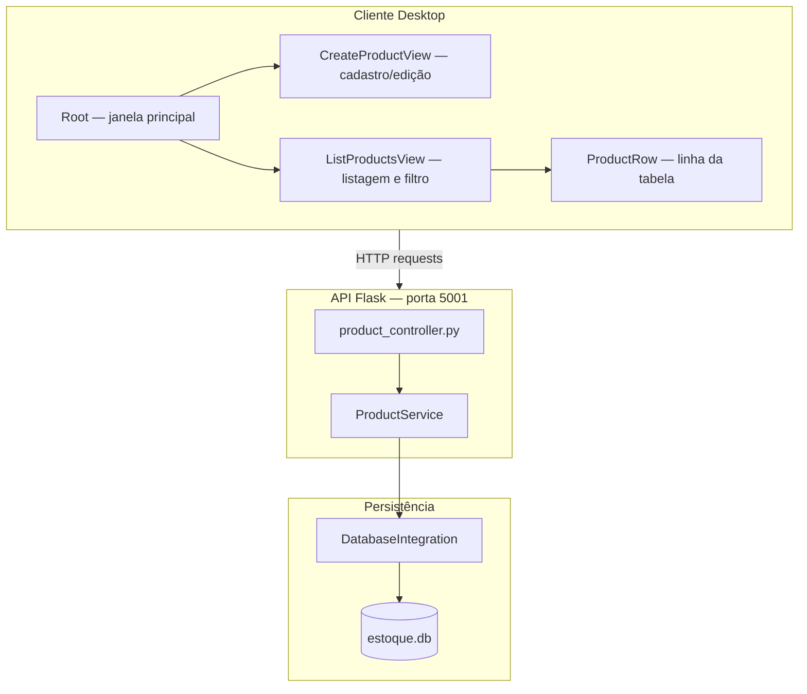
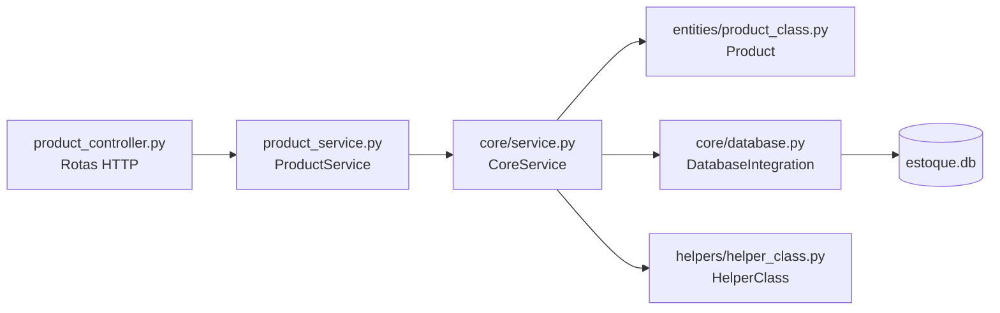
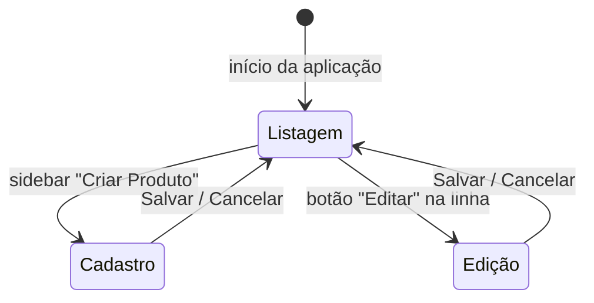
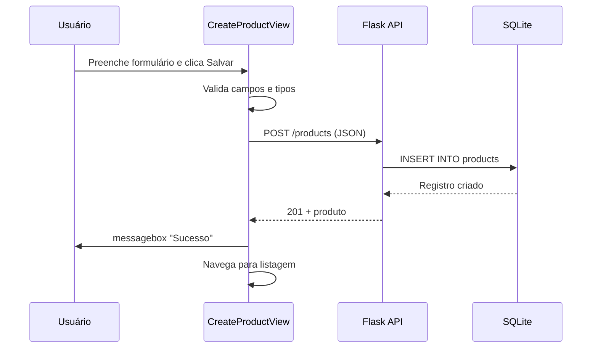
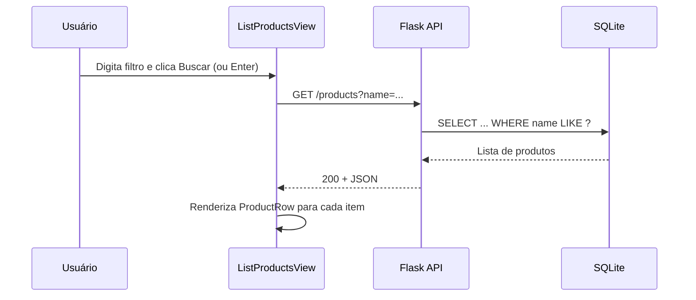
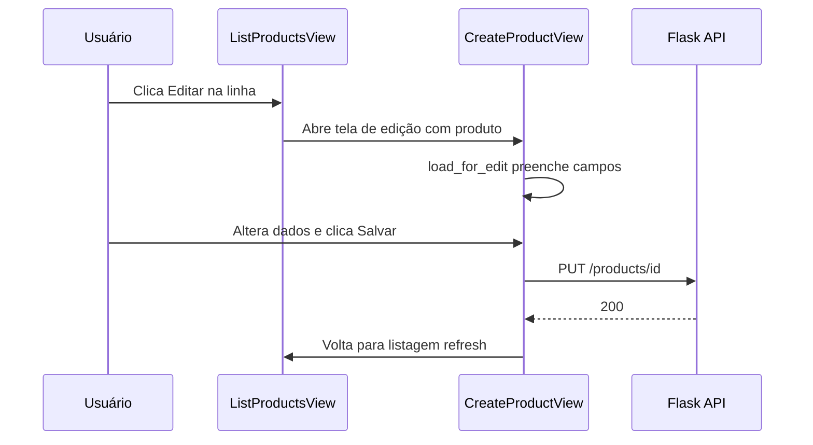
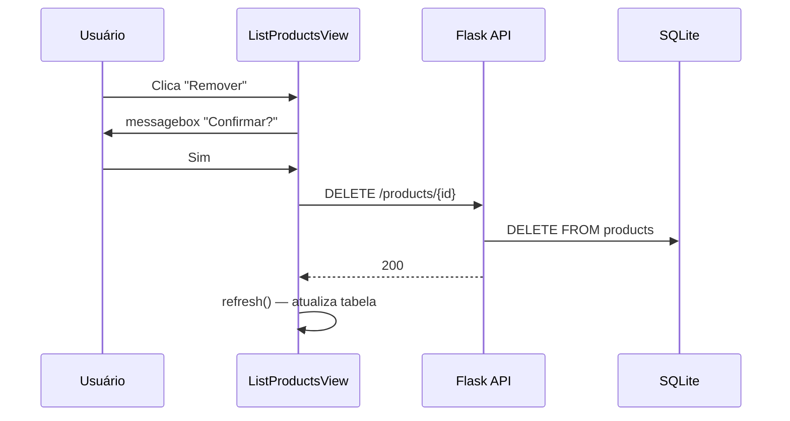
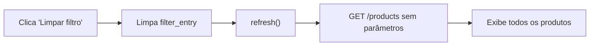

# Sistema de Gestão de Estoque RAD

Aplicação de gestão de estoque com arquitetura **cliente-servidor**: interface desktop em **Tkinter** e API REST em **Flask**, com persistência em **SQLite**.

---

## Sumário

- [Visão geral](#visão-geral)
- [Arquitetura](#arquitetura)
- [Estrutura do projeto](#estrutura-do-projeto)
- [Camadas do backend](#camadas-do-backend)
- [Interface desktop (Tkinter)](#interface-desktop-tkinter)
- [Banco de dados](#banco-de-dados)
- [API REST](#api-rest)
- [Fluxogramas](#fluxogramas)
- [Como executar](#como-executar)
- [Tecnologias](#tecnologias)

---

## Visão geral

O sistema permite o **CRUD completo de produtos** (criar, listar, filtrar, editar e remover) por meio de uma interface gráfica desktop. A interface não acessa o banco diretamente — todas as operações passam por uma API HTTP.

| Componente | Arquivo principal | Função |
|------------|-------------------|--------|
| Cliente desktop | `cliente_tkinter.py` | Interface gráfica (Tkinter) |
| API REST | `app.py` + `product_controller.py` | Endpoints HTTP |
| Regras de negócio | `product_service.py` + `core/service.py` | Camada de serviço |
| Persistência | `core/database.py` | SQLite (`estoque.db`) |
| Entidade | `entities/product_class.py` | Modelo `Product` |

---

## Arquitetura



### Fluxo de comunicação

```
┌──────────────────┐     HTTP (JSON)      ┌──────────────────┐     SQL       ┌─────────────┐
│ cliente_tkinter  │ ◄──────────────────► │  Flask API       │ ◄───────────► │  SQLite     │
│    (Tkinter)     │   GET/POST/PUT/DEL   │  :5001           │               │ estoque.db  │
└──────────────────┘                      └──────────────────┘               └─────────────┘
```

---

## Estrutura do projeto

```
estoque_rad/
├── app.py                    # Ponto de entrada da API Flask
├── cliente_tkinter.py        # Cliente desktop (interface gráfica)
├── product_controller.py     # Rotas REST (/products)
├── product_service.py        # Serviço específico de produtos
├── requirements.txt          # Dependências Python
├── estoque.db                # Banco SQLite (gerado automaticamente)
│
├── core/
│   ├── database.py           # Integração com SQLite (CRUD genérico)
│   └── service.py            # CoreService — camada de serviço base
│
├── entities/
│   └── product_class.py      # Entidade Product
│
└── helpers/
    └── helper_class.py       # Utilitários (parse JSON, row → dict)
```

---

## Camadas do backend



| Camada | Responsabilidade |
|--------|------------------|
| **Controller** | Recebe requisições HTTP, extrai parâmetros e retorna JSON |
| **Service** | Valida e orquestra operações; converte entre dict e entidade |
| **Entity** | Representa o produto (`name`, `category`, `quantity`, `price`) |
| **Database** | Executa SQL (insert, find, update, delete) no SQLite |
| **Helper** | Parse de documentos JSON e conversão de linhas do banco |

---

## Interface desktop (Tkinter)

### Layout da janela

```
┌──────────────┬────────────────────────────────────────────┐
│   SIDEBAR    │              ÁREA DE CONTEÚDO              │
│   200px      │                                            │
│   (preto)    │   CreateProductView  OU  ListProductsView  │
│              │                                            │
│  [Menu]      │                                            │
│              │                                            │
│  Criar       │                                            │
│  Produto     │                                            │
│              │                                            │
│  Listar      │                                            │
│  Produtos    │                                            │
└──────────────┴────────────────────────────────────────────┘
                    1000 × 600 px
```

### Componentes da UI

| Classe / função | Descrição |
|-----------------|-----------|
| `Root` | Janela principal, sidebar e roteamento entre telas |
| `CreateProductView` | Formulário de cadastro e edição de produtos |
| `ListProductsView` | Listagem com filtro, tabela rolável e ações |
| `ProductRow` | Uma linha da tabela (nome, categoria, qtd, preço, ações) |
| `form_button` | Botão estilizado para ações principais |
| `action_button` | Botão compacto (Editar / Remover) |
| `format_price` | Formata preço no padrão brasileiro (`R$ 1.234,56`) |

### Navegação entre telas



A troca de tela usa `pack_forget()` + `pack()` — padrão SPA em uma única janela, sem abrir janelas extras.

### Tela de listagem

```
┌─ Cabeçalho: "Listagem de Produtos" ─────────────────────┐
├─ Barra de filtro: [____] [Buscar] [Limpar filtro] ──────┤
├─ Tabela ────────────────────────────────────────────────┤
│  NOME DO PRODUTO │ CATEGORIA │ QTD │ PREÇO │ AÇÕES      │
│  › Produto A     │ Eletrôn.  │ 10  │ R$..  │ [E] [R]    │
│  › Produto B     │ Aliment.  │  5  │ R$..  │ [E] [R]    │
└─────────────────────────────────────────────────────────┘
```

A tabela é construída com **Canvas + Frame interno** (não usa `ttk.Treeview`), permitindo botões de ação em cada linha e controle visual total.

---

## Banco de dados

**Arquivo:** `estoque.db` (SQLite, criado automaticamente na primeira execução)

**Tabela:** `products`

| Coluna | Tipo | Descrição |
|--------|------|-----------|
| `id` | INTEGER | Chave primária (auto incremento) |
| `name` | TEXT | Nome do produto |
| `category` | TEXT | Categoria |
| `quantity` | INTEGER | Quantidade em estoque |
| `price` | REAL | Preço unitário |

---

## API REST

**Base URL:** `http://127.0.0.1:5001`

| Método | Endpoint | Descrição | Status de sucesso |
|--------|----------|-----------|-------------------|
| `GET` | `/` | Health check | 200 |
| `GET` | `/products` | Lista todos os produtos | 200 |
| `GET` | `/products?name=...` | Filtra por nome (LIKE) | 200 |
| `GET` | `/products/<id>` | Busca produto por ID | 200 |
| `POST` | `/products` | Cria produto | 201 |
| `PUT` | `/products/<id>` | Atualiza produto | 200 |
| `DELETE` | `/products/<id>` | Remove produto | 200 |

### Payload de criação/edição

```json
{
  "name": "Nome do Produto",
  "category": "Categoria",
  "quantity": 10,
  "price": 29.99
}
```

---

## Fluxogramas

### Criar produto



### Listar e filtrar



### Editar produto



### Remover produto



### Limpar filtro



---

## Como executar

### Pré-requisitos

- Python 3.8+
- pip

### 1. Instalar dependências

```bash
cd estoque_rad
pip install -r requirements.txt
```

Ou com ambiente virtual:

```bash
python3 -m venv venv
source venv/bin/activate   # Linux/macOS
# venv\Scripts\activate    # Windows
pip install -r requirements.txt
```

### 2. Iniciar a API (terminal 1)

```bash
python3 app.py
```

A API ficará disponível em `http://127.0.0.1:5001`.

### 3. Iniciar o cliente desktop (terminal 2)

```bash
python3 cliente_tkinter.py
```

> A API precisa estar rodando antes de usar o cliente. Se o servidor estiver offline, a listagem exibe uma mensagem com instruções e botão "Tentar novamente".

### Verificar se a API está ativa

```bash
curl http://127.0.0.1:5001/
```

Resposta esperada: `Server is running`

---

## Tecnologias

| Tecnologia | Uso |
|------------|-----|
| **Python 3** | Linguagem principal |
| **Tkinter** | Interface gráfica desktop |
| **Flask 3** | Framework da API REST |
| **SQLite** | Banco de dados local |
| **requests** | Cliente HTTP no Tkinter |

---

## Destaques da implementação Tkinter

- **Navegação SPA:** uma janela, múltiplas telas (`Frame`), sem `Toplevel`
- **Tabela customizada:** Canvas + Scrollbar + `ProductRow` (controle visual e ações por linha)
- **Formulário reutilizável:** mesma view para criar e editar (`editing_id`)
- **Botões estilizados:** `Label` + `bind("<Button-1>")` para identidade visual
- **Scroll multiplataforma:** mouse wheel em Windows/macOS e Linux
- **Tratamento de erros:** `messagebox` para alertas e mensagens inline na tabela
- **Constantes globais:** `API_URL`, `FONT_FAMILY` centralizadas
